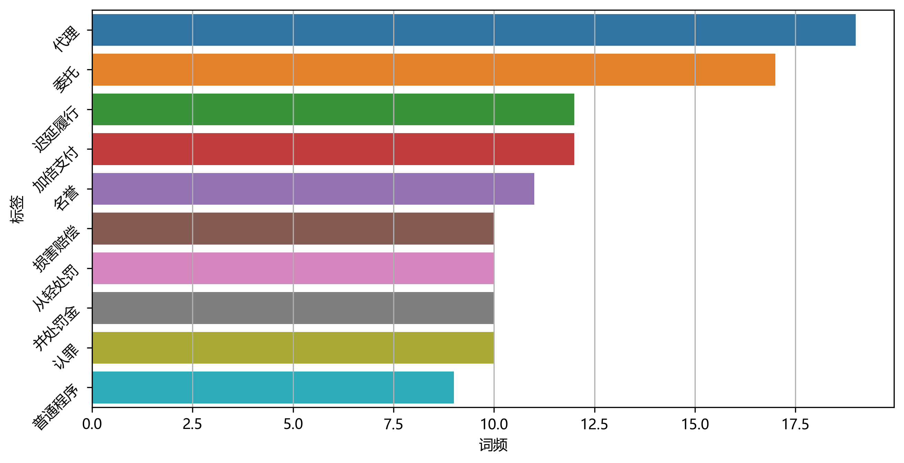
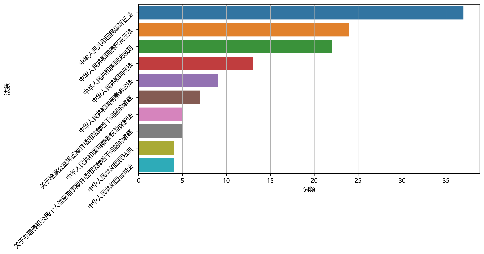

# 项目说明
该项目是一个针对[openlaw](http://openlaw.cn/index.jsp)网站的爬虫
目前已经实现了以下功能：
1. 前端页面
2. 保持SESSION登录状态（本地保存）
3. AI模式自动提取案件重点

# 运行项目
## 1. 安装依赖
在terminal中运行一下命令，安装依赖
```bash
pip install -r requirements.txt
```

```bash
streamlit run app.py
```

数据将会被存储在 `./data` 目录下

# 结果示例






